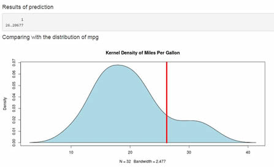

## Model Data

1. The data for the prediction model comes from the mtcars dataset


```
##       mpg         cyl          disp             hp             drat     
##  Min.   :10.4   4cyl:11   Min.   : 71.1   Min.   : 52.0   Min.   :2.76  
##  1st Qu.:15.4   6cyl: 7   1st Qu.:120.8   1st Qu.: 96.5   1st Qu.:3.08  
##  Median :19.2   8cyl:14   Median :196.3   Median :123.0   Median :3.69  
##  Mean   :20.1             Mean   :230.7   Mean   :146.7   Mean   :3.60  
##  3rd Qu.:22.8             3rd Qu.:326.0   3rd Qu.:180.0   3rd Qu.:3.92  
##  Max.   :33.9             Max.   :472.0   Max.   :335.0   Max.   :4.93  
##        wt            qsec      vs             am         gear    carb  
##  Min.   :1.51   Min.   :14.5   0:18   Automatic:19   3gears:15   1: 7  
##  1st Qu.:2.58   1st Qu.:16.9   1:14   Manual   :13   4gears:12   2:10  
##  Median :3.33   Median :17.7                         5gears: 5   3: 3  
##  Mean   :3.22   Mean   :17.8                                     4:10  
##  3rd Qu.:3.61   3rd Qu.:18.9                                     6: 1  
##  Max.   :5.42   Max.   :22.9                                     8: 1
```


--- .class #id 

## Prediction model

1. The application uses a multiple linear regression model using horsepower, weight and the type of trasmission as predictors


```r
 lm <- lm(mpg ~ hp + wt + am, data=mtcars)
 coef(lm)
```

```
## (Intercept)          hp          wt    amManual 
##    34.00288    -0.03748    -2.87858     2.08371
```

--- 
## Shiny app input

In the application, there's a slider to select car horsepower and weight.
There is also an option to select the type of transmission: Automatic or manual.


--- 
## Shiny app output

According to the linear model, the prediction results are displayed. 

For comparative reasons, the obtained value is shown together with a density plot of the mpg values of the dataset.

This way, you can estimate visually the area under the curve so that you can know how many cars presented lower or higher mpg values in the dataset.



